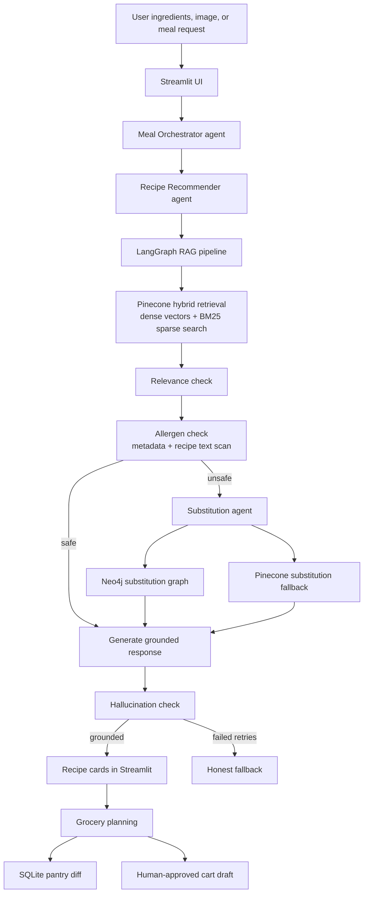

# AlloChef Demo Walkthrough

This walkthrough is a presenter-facing script for demoing AlloChef. It is based
on the current implementation described in `AGENTS_ARCHITECTURE.md`, plus the
Streamlit app and agent pipeline in this repo.

## Live Demo Script

Use this section as the main spoken walkthrough. The later sections are backup
architecture notes if someone asks deeper questions.

### 0. Opening

**Say:**

> Dinner is already a decision-heavy moment, and it gets harder when one person
> cannot eat shellfish, another avoids soy, and you are trying to use what is
> already in the fridge. AlloChef is an agentic meal-planning assistant that turns
> that messy question — "what can we safely cook tonight?" — into grounded recipe
> suggestions, substitutions, and grocery guidance from a single chat interface.

**Show:**

- The AlloChef Streamlit app.
- The chat interface.
- The sidebar with family profiles and pantry.

**Say:**

> Last week, the focus was the RAG layer: retrieval, grounding, chunking, and
> recipe safety. This week, the focus is the agentic system around it: the
> orchestrator, the grocery agent, pantry comparison, and the human-in-the-loop
> boundary for cart creation.

### 1. Set Up The Household Context

**Do:**

1. Open the sidebar.
2. Show the family member list.
3. Select a demo family member, for example:

   ```text
   Maya: shellfish, soy
   ```
4. Open the pantry section and show a few saved pantry items.

**Say:**

> This is the persistent memory layer. Family profiles and pantry items live in
> SQLite, so they survive across sessions. The selected family member determines
> the active allergy restrictions, and the pantry becomes the source of truth for
> what the household already has.

**Point out:**

- Profiles and pantry are not model memory; they are persistent application state.
- The user does not need to repeat allergies or pantry items in every prompt.
- The agent receives the active profile context for the current run.

### 2. Ask A Meal-Planning Question In Chat

**Do:**

In the chat box, ask:

```text
What can I cook tonight with chicken, garlic, and tomato?
```

**Say while it runs:**

> The chat request first goes to the Meal Orchestrator. Its job is not to retrieve
> recipes directly. Its job is to understand intent and route the request. Since
> this is a recipe recommendation request, it routes to the Recipe Recommender,
> which uses the existing RAG pipeline as one tool.

**When results appear, say:**

> I am not going to spend too long on the retrieval details because that was the
> Week 2 layer. The important Week 3 point is that the recipe result is structured
> state. That lets the next agent use the selected recipe for pantry comparison
> and grocery planning instead of treating the answer as just text.

**Show:**

- The assistant response.
- Recipe cards.
- Expand one card and show ingredients and instructions.
- Click or point to the grocery planning action.

**Say:**

> This is where the workflow moves from "recommend something" to "help me act on
> it." The user can choose a recipe, and the system can now plan what needs to be
> bought.

### 3. Show Pantry Comparison

**Do:**

1. Open the grocery planning flow for a selected recipe.
2. Show the section that compares the recipe ingredients against the saved pantry.
3. Point out "already have", "need to buy", and any uncertain matches.

**Say:**

> This part is intentionally deterministic. Pantry comparison is not a good use
> case for an LLM guessing from prose. The app has a saved pantry, a selected
> recipe with structured ingredients, and a tool that computes the diff: what is
> already available, what is missing, and what might need user confirmation.

**Highlight:**

- Deterministic: pantry lookup, normalization, ingredient comparison.
- Agentic: deciding when to enter grocery planning and using the result inside a multi-step workflow.
- Human-centered: uncertain matches are shown to the user rather than silently assumed.

### 4. Show Grocery Agent Behavior

**Do:**

Use the grocery planning screen for the selected recipe.

**Say:**

> The Grocery Agent sits on top of deterministic facts. It does not get to invent
> the pantry diff. First, the code computes what is missing. Then safety tools
> check whether any missing items conflict with the active family restrictions.
> If something is unsafe, the shared substitution layer looks for a safe
> replacement.

**If using a note field or natural-language pantry note, say:**

> The agentic part is useful when the user adds language like "I already have
> leftover tomatoes" or "skip anything I can substitute." The agent can interpret
> that note, but the plan is recomputed through deterministic tools afterward.

**Show:**

- Missing ingredients.
- Safe missing items.
- Unsafe or substituted items if present.
- Grocery list / cart draft.

**Say:**

> The strongest design choice here is that the LLM is not the source of truth for
> safety or shopping math. It helps with language and orchestration, but the facts
> are computed by tools.

### 5. Show Human-In-The-Loop Approval

**Do:**

Show the cart draft / approval step.

**Say:**

> This is the write-action boundary. The system can read, retrieve, compare,
> check, and draft autonomously. But it cannot approve a cart on its own. Before
> anything shopping-related is finalized, the human reviews the plan.

**Point out:**

- The user can review the grocery list.
- The user can inspect substitutions.
- The user approves before cart creation proceeds.

**Say:**

> That boundary is deliberate. Reads can be autonomous. Recommendations can be
> autonomous. But actions that create, modify, send, or purchase should have human
> approval.

### 6. Show Substitution As A Specialist Agent

**Do:**

If time allows, run an allergen-triggering chat request:

```text
What can I cook with cheese, mayonnaise, potato, garlic, crab, and tomato?
```

Use a selected family member with:

```text
shellfish, soy
```

**Say:**

> This is where the Substitution Agent becomes important. The graph identifies
> that a recipe is unsafe, but the context-aware replacement is handled by a
> specialist agent. It looks at candidate substitutes, checks safety, and chooses
> a replacement that makes sense for how the ingredient is used.

**Explain briefly:**

- Neo4j stores curated substitution relationships.
- Pinecone substitution search is a semantic fallback.
- The Substitution Agent chooses among candidates and verifies safety.

**Example substitutions to mention if relevant:**

```text
crab -> hearts of palm
crab -> jackfruit
shrimp -> king oyster mushrooms
shrimp -> chickpeas
```

### 7. Explain Agentic vs Deterministic

**Say:**

> The cleanest way to understand this project is to separate what is agentic from
> what is deterministic.

**Agentic:**

- Meal Orchestrator routes the user's chat intent.
- Recipe Recommender turns the request into a recipe search.
- Substitution Agent chooses context-aware swaps.
- Grocery Agent can interpret natural-language pantry notes.
- LangGraph coordinates state, branching, retries, and fallback behavior.

**Deterministic:**

- SQLite stores family profiles and pantry items.
- Pantry comparison computes already-have vs. missing ingredients.
- Safety tools check allergen conflicts.
- Cart approval is a UI gate.
- The app does not let an LLM silently approve shopping actions.

**Say:**

> That split is the point of the architecture. The agent uses language and tools,
> but the safety-critical parts stay inspectable and controlled.

### 8. Optional: Show Image-To-Ingredients

**Do, if time allows:**

Upload a fridge or grocery photo.

**Say:**

> The image flow uses GPT-4o vision only to identify ingredients from the photo.
> After that, it becomes the same agentic recipe pipeline as a text request.

**Flow to mention:**

```text
Photo -> GPT-4o vision -> ingredient list -> orchestrator/recommender -> LangGraph recipe workflow
```

**Say:**

> This keeps the vision model in the right role. It perceives what's in the image;
> it does not invent recipes or decide allergy safety.

### 9. Architecture Change Story

**Say:**

> Earlier, the project was mainly a RAG pipeline: retrieve recipes, check allergens,
> generate an answer. That proved the retrieval and grounding layer, but it was too
> narrow for the full product workflow.

**Continue:**

> I refactored it into a multi-agent system because the app became conversational.
> A user can now ask a normal meal-planning question, and the system has to route
> intent, call the recipe recommender, use the LangGraph workflow, call the
> Substitution Agent when needed, and optionally move into grocery planning.

**Short version:**

> RAG is now one capability inside the broader agentic system, not the entire app.

### 10. Closing

**Say:**

> AlloChef demonstrates an agentic AI system for a real multi-step household task.
> It uses LLM agents for language, routing, and context-aware choices; LangGraph
> for stateful orchestration; SQLite for persistent family and pantry memory;
> deterministic tools for pantry comparison and safety checks; and a human approval
> gate for cart creation.

**End with:**

> I know it works when a user can ask what to cook, select who is eating, and get
> a usable allergen-safe meal plan with substitutions and grocery guidance in under
> five minutes.

## 1. Demo Goal

AlloChef answers:

> What can I cook tonight with the ingredients I have, while respecting everyone
> eating tonight?

The demo should make three things clear:

1. AlloChef is not just a chatbot. It is an agentic meal-planning system with routing,
   retrieval, allergen checks, substitution reasoning, and grounded generation.
2. Safety-critical logic is deterministic where it matters: allergens, pantry
   comparisons, and final cart approval are not left to the LLM alone.
3. The app combines multiple knowledge systems: Pinecone for recipes, Neo4j for
   substitutions, SQLite for family and pantry state, and OpenAI models for
   language, reasoning, and image understanding.

## 2. Quick Architecture Story

Use this as the high-level explanation before showing the UI.



The core principle:

> LLMs handle language, routing, summarization, and context-aware substitution.
> Deterministic code handles safety, known facts, pantry math, and approval gates.

## 3. What Each System Stores

| System | Stores | Why it exists |
|---|---|---|
| Pinecone recipe index | Recipe chunks, dense vectors, BM25 sparse vectors, recipe metadata, allergen flags | Fast hybrid retrieval over 231k+ Food.com recipes |
| Pinecone substitution index | Embedded substitution entries | Semantic fallback when Neo4j does not have a curated substitute |
| Neo4j Aura | Ingredient nodes, allergen nodes, substitution edges | Deterministic graph lookup for safe substitutions |
| SQLite | Family profiles and pantry items | Persistent app state across sessions |
| LangGraph state | Current request state: ingredients, restrictions, retrieved docs, unsafe pairs, substitutions, checks, response | Runtime coordination between nodes |
| OpenAI models | No persistent app data | Vision extraction, LLM routing, response generation, evaluation checks |

## 4. Demo Prep Checklist

Before the demo:

1. Activate the environment:

   ```bash
   cd /Users/shivani/projects/mastering_agentic_ai/allochef
   source .venv/bin/activate
   ```

2. Confirm required secrets exist in `.env` or Streamlit secrets:

   ```text
   OPENAI_API_KEY
   PINECONE_API_KEY
   PINECONE_INDEX_NAME
   PINECONE_SUBS_INDEX_NAME
   NEO4J_URI
   NEO4J_USERNAME
   NEO4J_PASSWORD
   ```

3. If substitution seed data changed, sync Neo4j:

   ```bash
   python -m ingestion.graph_loader
   ```

4. Start the app:

   ```bash
   streamlit run app.py
   ```

5. Keep this optional debug log visible if you want to explain checks:

   ```text
   logs/agent_checks.jsonl
   ```

## 5. Demo Flow

### Step 1 — Introduce the UI

Open the Streamlit app.

Say:

> This is AlloChef. The main interaction is simple: ask what you can cook in chat
> or scan a fridge/photo, select who is eating, and the app creates recipe
> suggestions that fit the household's constraints.

Point out:

- The sidebar brand and family profiles.
- The active family member toggles.
- The allergen badges under each profile.
- The pantry section.
- The agent debug log expander.

### Step 2 — Show Family Profiles

Create or use a demo family member.

Example:

```text
Maya: shellfish, soy
```

Say:

> Family profiles are persisted in SQLite. When I select Maya, her allergens
> become active restrictions for this meal. The agent does not need the user to
> restate them in the prompt.

Important talking point:

> LangGraph state holds the restrictions only during this run. SQLite is what
> remembers profiles across app sessions.

### Step 3 — Run a Basic Recipe Search

Use a simple chat request first:

```text
What can I cook tonight with chicken, garlic, and tomato?
```

Click **Find Recipes**.

Say:

> This goes through the Meal Orchestrator, then the Recipe Recommender, then the
> LangGraph RAG pipeline.

Explain what happens internally:

1. The Recipe Recommender extracts the available ingredients.
2. Pinecone hybrid retrieval finds relevant recipe chunks.
3. Relevance check confirms the retrieved docs match the request.
4. Allergen check verifies the recipe metadata and recipe text.
5. The generator creates a structured answer from retrieved context.
6. The hallucination checker verifies the recipe names and facts are grounded.
7. Streamlit renders recipe cards from the structured result.

Point out:

- Recipe cards are not hallucinated free-form recipes.
- They come from retrieved Food.com recipe chunks.
- Expanding a card shows ingredients and instructions.

### Step 4 — Show Why Hybrid Retrieval Matters

Say:

> Hybrid retrieval matters because users search in two different ways. Sometimes
> they use broad meaning, like "quick dinner with tomato and chicken." Dense
> embeddings help with that. Sometimes they search exact terms, like a recipe
> name, "paneer canapes", or an ingredient like "crab." BM25 helps preserve exact
> lexical matches.

Implementation detail:

> Pinecone stores both the dense embedding and the sparse BM25 vector. At query
> time, `pinecone-text` encodes the query into a sparse vector using the saved
> BM25 encoder, and Pinecone combines dense and sparse signals.

### Step 5 — Show Allergen + Substitution Flow

Use an allergen-triggering chat request.

Recommended demo message:

```text
What can I cook with cheese, mayonnaise, potato, garlic, crab, and tomato?
```

Use a profile with:

```text
shellfish, soy
```

Say:

> I intentionally included crab while the selected family member has a shellfish
> allergy. The system should not hide this. It should retrieve close recipes,
> identify unsafe ones, and route them through substitution.

Expected explanation:

1. Retrieval can still find crab recipes because crab is part of the user input.
2. The allergen check marks shellfish-containing recipes as unsafe.
3. The substitution node looks for the culprit ingredient.
4. Neo4j is checked first for curated substitutes.
5. Pinecone substitution search is used only as fallback.
6. The substitution agent chooses a context-aware substitute and safety-checks it.

Example substitutions to mention:

```text
crab -> hearts of palm
crab -> jackfruit
shrimp -> king oyster mushrooms
shrimp -> chickpeas
```

Say:

> This is where GraphRAG appears in the project. The substitution knowledge is
> graph-shaped: ingredients, allergens, and safe substitution edges.

### Step 6 — Explain False Positive Protection

Say:

> During ingestion, recipes have allergen metadata generated from ingredient
> embeddings. That is useful, but it can over-flag. At runtime, AlloChef verifies
> an unsafe flag by scanning the retrieved recipe text for known allergen
> ingredients. This avoids blindly substituting because of a noisy metadata flag.

Example:

> If a recipe were flagged as milk but the text does not contain dairy terms like
> milk, cheese, whey, casein, yogurt, or cream, the runtime check can treat that
> as a likely false positive.

### Step 7 — Show Image Input

Upload a fridge or grocery photo.

Say:

> Image input uses GPT-4o vision only to extract ingredients. After that, the
> pipeline is the same text-based RAG flow. The image model does not retrieve
> recipes and does not decide safety.

Flow:

```text
Image -> GPT-4o vision -> ingredient list -> hybrid retrieval -> checks -> cards
```

Good talking point:

> This keeps the image step clean. Vision is used for perception, not for
> hallucinating recipes.

### Step 8 — Show Grocery Planning

Open a recipe card and use the grocery planning action.

Say:

> Once a recipe is selected, the grocery flow compares the recipe ingredients
> against the saved pantry. This part is deterministic because set comparison and
> allergen safety are not good places to rely on the LLM.

Explain:

1. Pantry is stored in SQLite.
2. Pantry diff finds what is already owned and what is missing.
3. Missing items are checked against active restrictions.
4. Unsafe missing items get substitutes.
5. The cart is created only after human approval.

Important:

> The agent never places an order by itself. The cart step is human-gated.

## 6. Agentic Architecture Talking Points

Use this section if someone asks, "What makes it agentic?"

AlloChef has both LLM agents and a LangGraph workflow.

### LLM Agents

| Agent | What it decides |
|---|---|
| Meal Orchestrator | Whether the user wants recipes or grocery planning |
| Recipe Recommender | Extracts ingredients and calls the RAG search tool |
| Substitution Agent | Chooses the best context-aware substitute |
| Grocery Agent | Interprets optional natural-language pantry notes |

### LangGraph RAG Nodes

| Node | Purpose |
|---|---|
| `aggregate_restrictions` | Combine active family allergens |
| `hybrid_retrieve` | Search Pinecone with dense + BM25 |
| `check_relevance` | Judge whether retrieved docs match the query |
| `rewrite_query` | Retry retrieval if relevance fails |
| `allergen_check` | Separate safe and unsafe recipes |
| `retrieve_substitute` | Find safe substitutions for unsafe recipes |
| `generate_response` | Generate grounded recipe suggestions |
| `check_hallucination` | Reject unsupported recipe names/details |
| `fallback_response` | Admit uncertainty after max failed retries |

The key agentic behavior is not merely calling an LLM. It is:

- The system observes intermediate results.
- It branches based on those results.
- It retries retrieval or generation when checks fail.
- It uses tools and databases.
- It has bounded failure behavior instead of pretending to know.

## 7. Safety Story

This is the safety narrative to emphasize:

1. User restrictions come from selected family profiles.
2. Retrieval gets candidate recipe chunks.
3. Allergen detection uses two signals:
   - index-time metadata flags
   - runtime recipe text verification
4. Unsafe recipes are not discarded automatically; they can be repaired through
   substitutions.
5. Substitutes are checked against all active restrictions, not only the original
   allergen.
6. Hallucination checks prevent unsupported recipe names/details from being shown
   as confident answers.
7. If the model cannot produce a grounded answer after retries, AlloChef says it
   cannot confidently answer.

## 8. What To Say About RAG

Short version:

> AlloChef retrieves real recipe chunks before generating. The LLM response is
> grounded in those chunks, and the UI cards are rendered from the structured RAG
> state.

Detailed version:

> The recipe corpus was cleaned, allergen-tagged, chunked into overview and
> instruction chunks, embedded with `text-embedding-3-small`, and indexed in
> Pinecone. Each query is embedded and also BM25-encoded. Pinecone returns the
> most relevant chunks using both semantic and lexical matching.

## 9. What To Say About GraphRAG

Short version:

> We use GraphRAG specifically for substitutions, not for the recipe corpus.

Detailed version:

> Substitutions are naturally graph-shaped. An ingredient can trigger an allergen,
> and an ingredient can substitute for another ingredient in specific cooking
> contexts. Neo4j stores these relationships. When a recipe contains a restricted
> ingredient, AlloChef queries the graph first. If the graph does not have a
> good candidate, it falls back to semantic substitution search in Pinecone.

## 10. Suggested Demo Inputs

### Basic grounded recipe search

```text
chicken, garlic, tomato
```

Expected story:

- Shows standard RAG retrieval.
- Should produce named recipes and cards.
- Good for proving the app is working.

### Vegetarian/common pantry search

```text
paneer, chilli, potato
```

Expected story:

- Shows exact ingredient matching.
- Useful to talk about BM25.

### Allergen substitution search

```text
cheese, mayonnaise, potato, garlic, crab, tomato
```

With active restrictions:

```text
shellfish, soy
```

Expected story:

- Shows unsafe recipe detection.
- Shows substitution graph lookup.
- Good for explaining why Neo4j exists.

### Image scan

Use a grocery/fridge image with visible items.

Expected story:

- GPT-4o vision extracts ingredients.
- RAG pipeline remains unchanged.

## 11. If Something Goes Wrong During Demo

### App returns fallback

Say:

> The fallback is intentional. The hallucination guard rejected the generated
> response after bounded retries. In a safety-sensitive recipe app, this is better
> than inventing a recipe.

Then try:

```text
chicken, garlic, tomato
```

### No substitutions appear

Check:

1. Is an active family member selected?
2. Does that member have the allergen selected?
3. Has `python -m ingestion.graph_loader` been rerun after editing
   `seed_substitutions.json`?
4. Is Neo4j Aura running?

### Image scan works but recipes are broad suggestions

Say:

> The vision model identified ingredients correctly. The retrieval step may still
> return close matches that need extra ingredients. The UI labels these as
> suggestions rather than exact ready-to-cook recipes.

### Sidebar/profile state looks stale

Refresh the app. Profiles and pantry are persisted in SQLite, but Streamlit
session state can preserve transient UI state during a live session.

## 12. Short Closing Script

Use this to wrap the demo:

> AlloChef is a practical agentic RAG system. The recipe corpus lives in Pinecone
> with hybrid retrieval. Substitutions use a Neo4j graph, with semantic fallback.
> Family profiles and pantry data persist in SQLite. LangGraph coordinates
> retrieval, relevance checks, allergen checks, substitution, generation, and
> hallucination checks. The LLM is used where language and reasoning matter, while
> deterministic code owns safety-critical facts and user approval.

## 13. Files To Mention If Asked

| File | Purpose |
|---|---|
| `app.py` | Streamlit UI, image scan, recipe cards, grocery modal |
| `agent/meal_orchestrator.py` | Top-level intent routing agent |
| `agent/recipe_recommender_agent.py` | Recipe search agent wrapper |
| `agent/graph.py` | LangGraph node wiring |
| `agent/nodes.py` | RAG nodes, retrieval, checks, response generation |
| `agent/substitution_agent.py` | Context-aware substitution agent |
| `agent/grocery_agent.py` | Pantry diff, grocery planning, cart draft |
| `agent/pantry_tools.py` | Deterministic pantry comparison tools |
| `agent/safety_tools.py` | Deterministic grocery safety checks |
| `profiles.py` | SQLite family profiles |
| `pantry.py` | SQLite pantry store |
| `ingestion/indexer.py` | Pinecone recipe/substitution indexing |
| `ingestion/graph_loader.py` | Loads substitution JSON into Neo4j |
| `data/substitutions/seed_substitutions.json` | Curated substitution seed data |
| `logs/agent_checks.jsonl` | Relevance and hallucination check logs |
